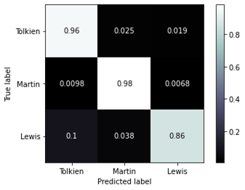

# Tolkien vs. Martin vs. Lewis - bloggers

---

### Repository Contents

This repository is structured as follows:
 - code
   - scraping.ipynb (the jupyter notebook used for web-scraping)
   - reddit_info.py (API access information - this is private and the information has been redacted here)
   - clean_explore.ipynb (the jupyter notebook used forcleaning and exploring the corpora)
   - modeling.ipynb (the jupyter notebook used for the modeling process)
 - data
   - corpus_raw.csv (the raw documents scraped from Reddit)
   - corpus.csv (the clean documents)
 - assets
   - (other supporting files)
   
---

## Problem

Given text documents from three different blogs, can an algorithm be devised to discriminate class membership? Documents are taken from three SubReddits that discuss the works of J.R.R. Tolkien, George R.R. Martin, and C.S. Lewis.

## Data

SubReddits:
 - *The Lord of the Rings* series by J.R.R Tolkien
   - [r/tolkienfans](https://www.reddit.com/r/tolkienfans/)
 - *A Song of Ice and Fire* series by George R.R. Martin
   - [r/asoiaf](https://www.reddit.com/r/asoiaf/)
 - *The Chronicles of Narnia* series by C.S. Lewis
   - [r/Narnia](https://www.reddit.com/r/Narnia/)

The Python library PRAW (Python Reddit API Wrapper) was used to aggregate corpora from each SubReddit. The API allows one to scrape as many as 1,000 posts at a time. It offers specific categories to request from, including "top" (the top posts), "hot" (the most hot posts), "controversial" (the most controversial posts), and "new" (the newest posts). After the initial scraping there were 20,504 documents total. This was achieved by storing both the heading and body of each request for all four categories of all three SubReddits. Inevitably, there is a lot of overlap among the four categories, so repeated documents had to be removed. After removing duplicates and empty requests there were 11,093 documents left. Of this, Tolkien made up 4,936 (0.445), Martin made up 5,324 (0.48), and Lewis made up 833 (0.075). 

A bag of words approach was used to preprocess the corpus. This means that all punctuation, special characters, capitalization, and extra whitespace was removed. Any hyper-links were removed as well. To correct for the imbalanced class sizes, 3,000 synthetic documents were created from the Lewis corpus using a Markov Chain model. This upsampling resulted in a stratification where Tolkien made up 0.327 of the corpus, Martin made up 0.353, and Lewis made up 0.32. The Python class ("MCGen") used for upsampling has been left out of this repository, but can be found in a separate repository at [this link](https://github.com/willarliss/MC-Generate). An in-depth break down of the process can be found [here](https://towardsdatascience.com/upsampling-minority-classes-in-imbalanced-text-classification-problems-using-markov-chains-312fded5c2f5).

Both headings and bodies of SubReddit posts were included in order to use as much vocabulary as possible in the modeling. No stemming or lemmitization was done in preprocessing. N-grams were used later on in the modeling process.

## Modeling/Analysis

To explore the corpora, words unique to each SubReddit were identified. There were 640 unique words in the Tolkien corpus, 2,702 in the Martin corpus, and 37 in the Lewis corpus. The most frequently used unique words were character names. It was found that Tolkien and Martin shared 4,272 words that Lewis did not have, Lewis and Tolkien shared 54 words that Martin did not have, and Martin and Lewis shared 97 words that Tolkien did not have. This analysis was done prior to upsampling.

Two models were optimized both with and without upsampled corpora, resulting in 4 models total to consider. TF-IDF scores were used in all models. A Linear SVM model and a Multinomial Naive Bayes model were tested. It was found that a Multinomial Naive Bayes model that uses upsampling, a feature limit of 10,000, n-grams ranging from 1 to 3, English stop-words, TF-IDF smoothing, no prior fit, and a regularization of 0.1 performed best.

## Findings

After the classification model was chosen, it was tested on unseen documents. At the beginning of the modeling process, a "holdout" set was put aside so that the model could be evaluated on documents it had not seen before. On this holdout set, the model achieved 96.11% accuracy (roughly 3 times higher than the baseline accuracy) and a macro-recall score of 93.52%. Macro-recall calculates the mean of the true-positive-rates between every class. The performance of the model is demonstrated in the confusion matrix below.

## Next Steps

Moving forward, the limitations of this project must be addressed. These limitations include sampling bias and class imbalance. Sampling bias exists in this project due to the nature of the document scraping. Documents were only scraped from categories that contained the "most *blank*" features, i.e. the most hot posts, the most controversial posts, and the most recent posts. In order to gather a more representative sample, posts should be scraped from all orders of the SubReddits. Class imbalance was addressed by synthetic oversampling, but this technique is never preferred to having more real data. The best way to address both of these issues is to reform the scraping process.

More models might also be considered for this problem. Gradient boosted decision trees and convolutional neural networks can work well for text classification problems. There are also other versions of SVM and Naive Bayes that could be considered.

It would also be interesting to build a model on meta-data from the corpora (word counts, special characters, etc.) to be run alongside the text classifier. Perhaps combining the predictions of both could increase accuracy.

